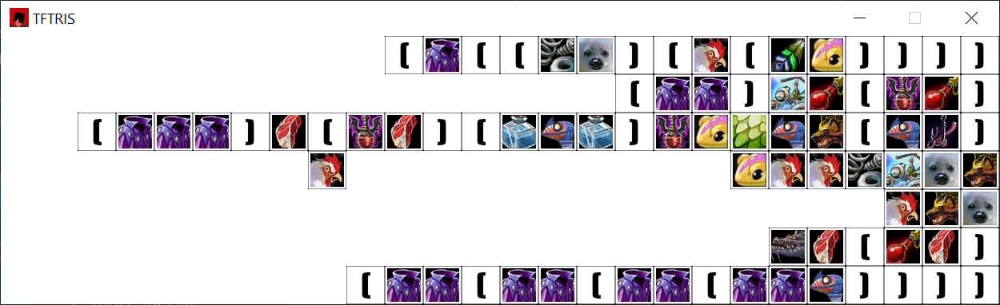

# TFTRIS

Puzzler inspired by Alexei Pajitnov's most famous work of game design, Rat Poker.

Also I have added a lot of TF but it doesn't really play like anything yet.

I'm using the GPL for now because I can't think of a legitimate reason anyone would need to redistribute this. (Note that the placeholder icons are borrowed from World of Warcraft and cannot _possibly_ be used commercially; only the code itself is protected.) 

If you want different licensing terms, ask me!